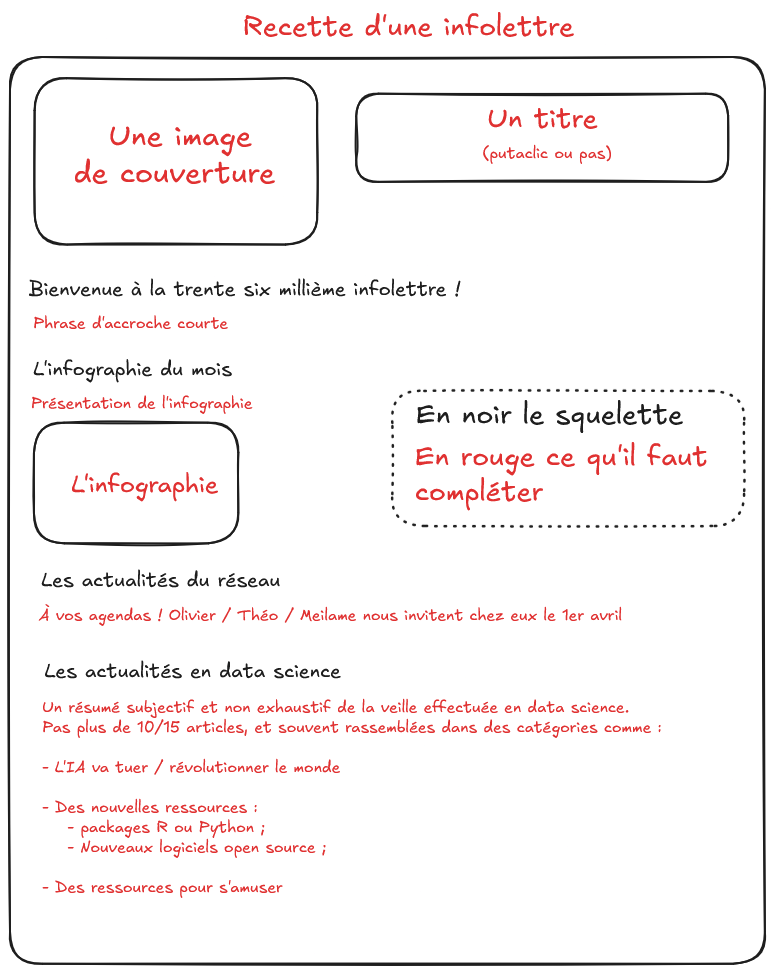
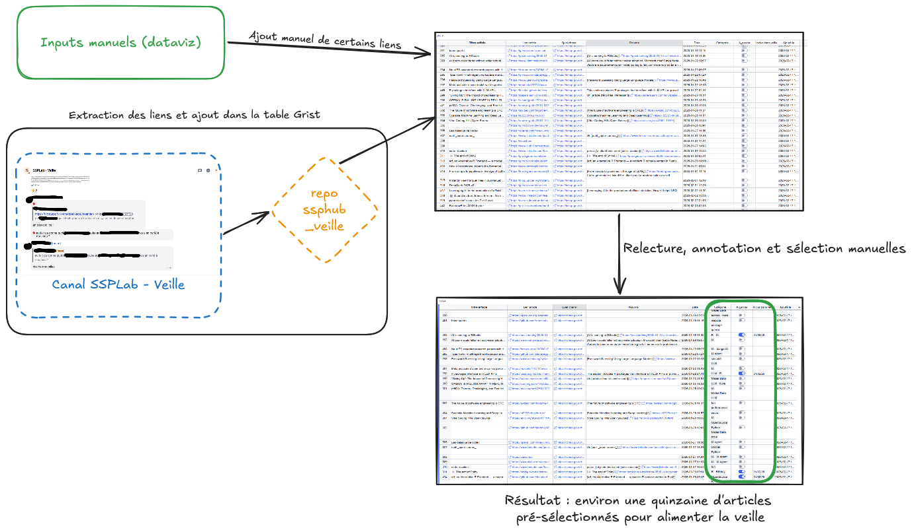

# Le `SSP Hub` : un réseau pour les _data scientists_ du service statistique public

## Les besoins et les objectifs du réseau

- Besoin de __[formation en continu]{.blue2}__ dans un _champ_ mouvant

- Besoin d'[**échanges**]{.blue2} et d'[__émulation__]{.blue2} entre _data-scientists_

- Besoin de casser les silos

Solution :

- un réseau pour [__tous les agents__]{.blue2} (chefs ou pas, experts ou pas) du SSP ;

- faire du site [ssphub.netlify.app](https://ssphub.netlify.app/) :
    - une [**vitrine**]{.blue2} des projets novateurs ;
    - un centre de ressources ;
    - un site de blog ;
    - un lieu de stockage de la connaissance (ateliers, replay, infolettres) ;

- une newsletter du réseau pour le faire vivre (postée aussi sur le réseau).

# La refonte du site en cours

## Objectifs

- Inclure les projets innovants ;
  - avoir une page par projet afin de visibiliser le travail du SSP, notamment vis à vis d'Eurostat
  - chaque page dépend de(s) personne(s) en charge du projet
  - dans la [version en cours](https://inseefrlab.github.io/ssphub/pr-preview/pr-112/), 30 projets en cours de relecture [(j'attends encore vos retours 😅)]{.blue2}

- Avoir une version anglaise du site (en Quarto) ;
  - choix technique : [babelquarto](https://docs.ropensci.org/babelquarto/articles/babelquarto.html) dans la version en cours

- Décommissionner les anciens sites du SSPLab ([ici](https://ssplab.lab.sspcloud.fr/) et [le statoscope](https://statoscope.wordpress.com/)).

# Les outils

## L'automatisation partielle de la gestion du réseau

Principalement deux outils, reposant sur Grist et Tchap :

- un [annuaire du réseau](https://grist.numerique.gouv.fr/o/ssphub/iTFX7gryL8jK/Annuaire) pour s'inscrire et se désinscrire (environ 650 personnes directement inscrites, 350 de par leur fonction) ;
- des boites à outils :
  - le repo [ssphub_veille](https://github.com/SSPHub/ssphub_veille) pour automatiser partiellement la veille ;
  - le repo [newsletter_tools](https://github.com/SSPHub/newsletter_tools) pour automatiser certaines étapes d'envoi de la veille :
    - génération d'email à partir d'un fichier Qmd ;
    - récupération de la dernière liste de l'annuaire ;
    - suppression des adresses emails invalides ;
    - génération de la newsletter en format pour envoyer dans Tchap.

## Comment faire une (bonne) newsletter ?

## Faire la veille

## Show time

# Idées suivantes

## Comment aider ?

- relire les projets qui vous ont été attribués ;

- alimenter le site avec des posts de blog (qui sont toujours courts ! ) ;

- des volontaires pour la veille ? (💓 Laura pour la dernière)

- trouver des idées d'atelier ;

- faire vivre le réseau quoi, en un mot.

## Ce qui viendra peut être :

- Utilisation de bot sur Tchap pour :
    - extraire les informations de la veille
    - poster la newsletter
- Utilisation d'agents pour automatiser le remplissage du Grist de la veille :
    - trouver le titre des articles ;
    - résumer les articles ;
    - les tagguers.
- Utilisation d'IA pour rédiger une v1 de l'infolettre à partir d'un squelette donné par l'utilisateur

