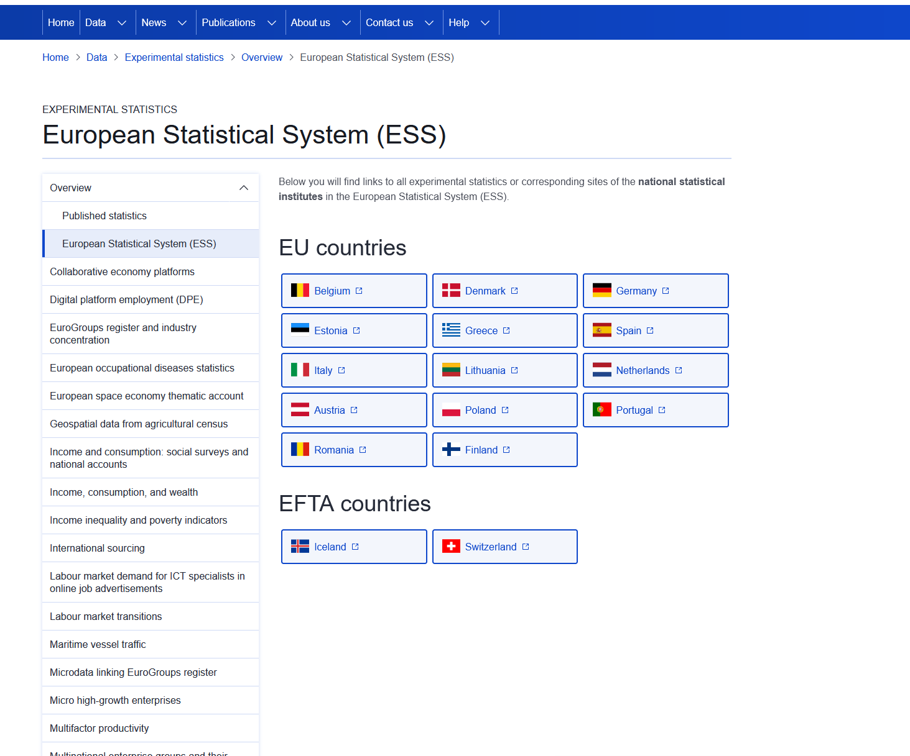
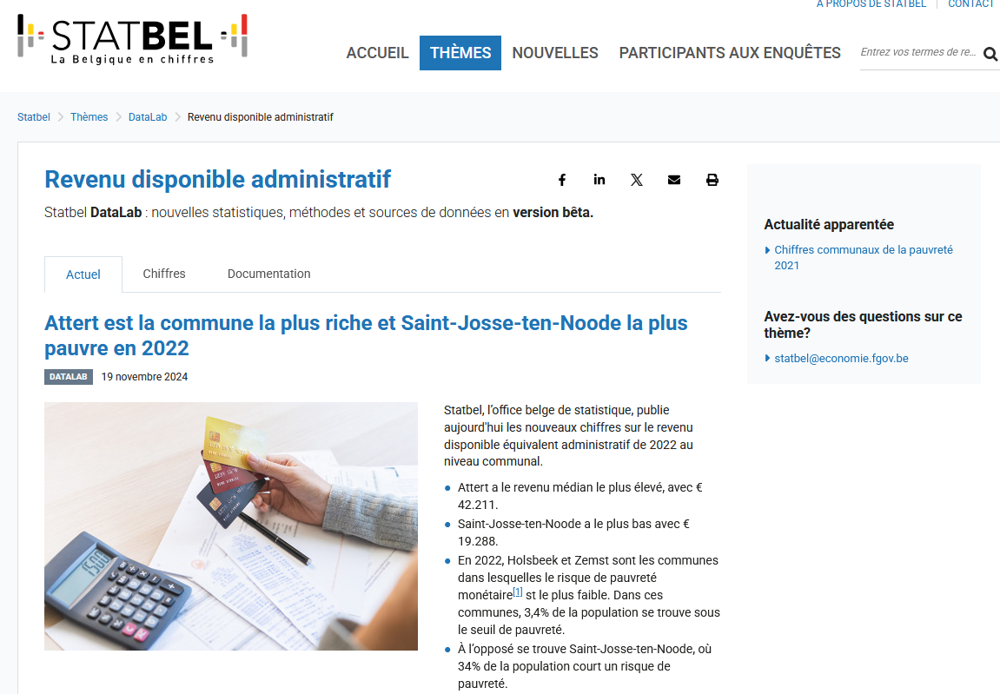
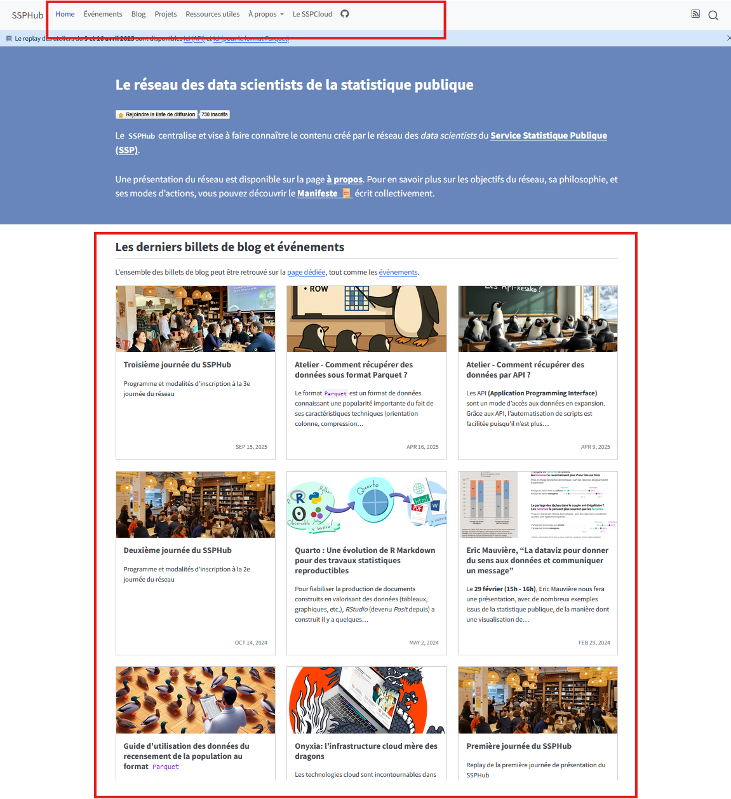
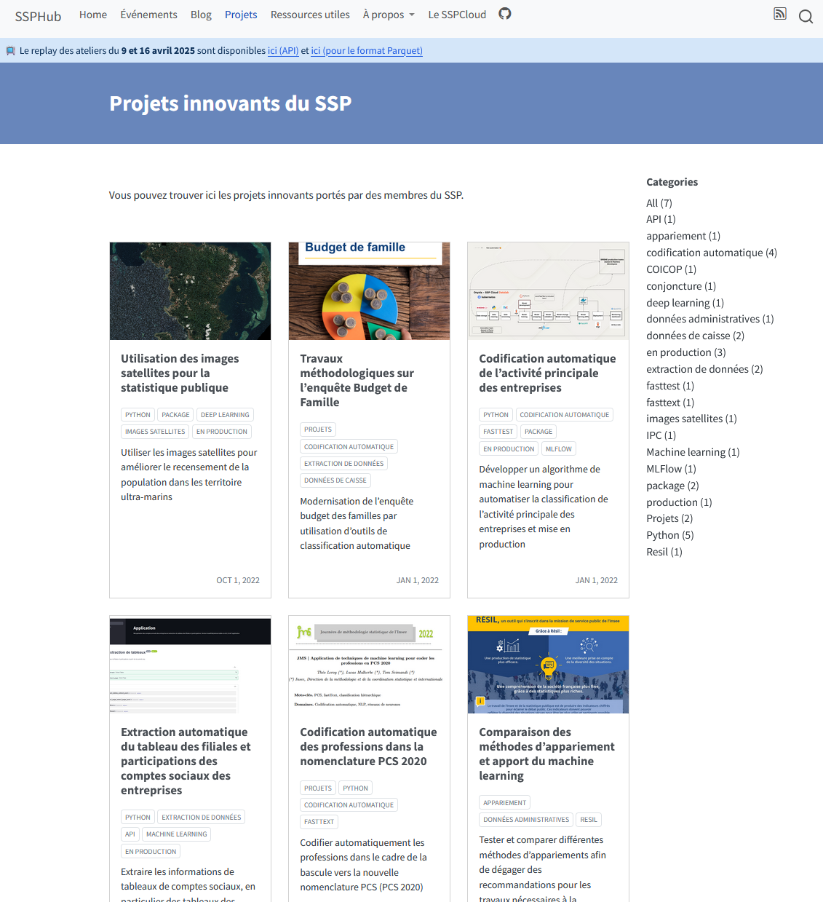
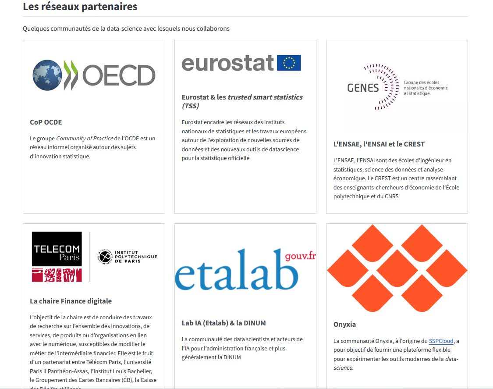
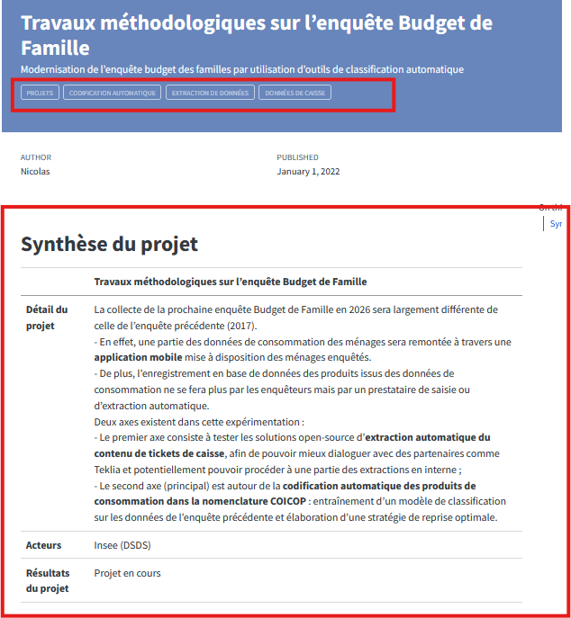

## Le `SSP Hub` : un réseau pour les _data scientists_

## Principaux constats

- Besoin de __[formation en continu]{.blue2}__ dans un _champ_ mouvant

. . .

- Besoin d'[**échanges**]{.blue2} entre _data-scientists_ et de casser les silos

. . .

- Besoin d'une [**vitrine**]{.blue2} pour les projets novateurs

## Public cible

- [__Tous les agents__]{.blue2} du Service Statistique Public:
    + Indépendamment du niveau d'expertise
    + Chacun peut s'intéresser à une partie restreinte des ressources

. . .

- Proposer du [__contenu pour tous__]{.blue2} :
    + Différents niveaux ressources coexistent
    + Entrées thématiques

## Objectifs

- Faciliter l’[__échange entre pairs__]{.blue2} et l'[__émulation__]{.blue2}
- Organisation d'événements (séminaires, journée de la _data science_, _masterclass_...) ;

. . .

- Offrir une [__vitrine__]{.blue2} des initiatives de data science
- Production de contenu sur <https://ssphub.netlify.app/> (posts de blog, _newsletters_...) ;
- [__Relayer des formations__]{.blue2} et ressources utiles

. . .

- [__Accompagner__]{.blue2} de manière ponctuelle des équipes

. . .

- [__Valoriser compétences__]{.blue2} des profils data scientists

## Rejoindre le réseau

- Vous pouvez déjà suivre les actualités du réseau !

- Une inscription [par ici](https://grist.numerique.gouv.fr/o/ssphub/forms/jSjAV3L2F8mmiRVuVEpfF7/103) ou par mail à <ssphub-contact@insee.fr>

# Comparaison des autres sites de statistiques expérimentales

## Résumé

Comparaison de 4 sites d'autres INS (DE, IT, BE, NL) listés sur le sites de statistiques expérimentales de [Eurostat](https://ec.europa.eu/eurostat/web/experimental-statistics/overview/european-statistical-system)

::::: columns
::: {.column width="50%"}
**Ce que les autres ont et le site SSPHub n'a pas**  

- existe en **anglais**  
- téléchargement des **données produites**  
- présentation stable par projet, avec une page par projet permettant de savoir ce qui a été fait et est encore utilisé
:::

::: {.column width="50%"}
**Ce que le SSPLab a et les autres non**  

- Beaucoup de publication **open source**  
- Une vision plus large que les **seules statistiques expérimentales** (croisement de données administratives, webscrapping) et tournée vers l'innovation méthodologique

:::
:::::

{fig-align="center"}

## Belgique - [Statbel](https://statbel.fgov.be/en/themes/datalab)

::::: columns
::: {.column width="55%"}

:::

::: {.column width="45%"}
-   une structure stable en trois onglets (pas toujours remplis) avec un descriptif et la présentation des principaux résultats avec des graphiques
-   17 présentations de statistiques expérimentales par Statbel

:::
:::::

---

::::: columns
::: {.column width="30%"}
**Points forts**

- existe en anglais
- téléchargement des données produites
:::

::: {.column width="70%"}
**Améliorations**

- Pas de publication open source
- une vision centrée sur les statistiques expérimentales, incluant le croisement de données administratives (un seul à partir de nouvelles données trouvé sur 8 projets)
- centré sur des statistiques expérimentales plus que sur des méthodes ou données innovantes : **1 seul projet sur les 10 serait considéré comme de l'innovation à l'Insee**

:::
:::::

### Quelques exemples belges

-   Carroyage de la population : [Grid à mailles variables, décembre 2024](https://statbel.fgov.be/fr/themes/datalab/grid-mailles-variables) ou [proximité d'infrastructure essentielle](https://statbel.fgov.be/fr/themes/datalab/decoupages-geographiques): carroyage de la population belge et proximité (5km, 10km, 20km) d'une infrastructure dite essentielle
-   [Revenu disponible administratif, novembre 2024](https://statbel.fgov.be/fr/themes/datalab/revenu-disponible-administratif#news) : le but est de calculer un revenu médian par commune à partir des registres légaux de population
-   [Statistiques sur les unités établissements, juin 2024](https://statbel.fgov.be/fr/themes/datalab/statistiques-sur-les-unites-etablissements) : le but est de répartir l'emploi au niveau de l'établissement et non agrégé au niveau de l'établissement mère, afin d'avoir une répartition géographique des emplois plus fine au niveau national

---

### Autres exemples de statistiques expérimentales

-   [Entrepreneurs indépendants, mars 2025](https://statbel.fgov.be/fr/themes/datalab/entrepreneurs-independants) : estimation annuelle des entrepreneurs par croisement de données administratives
-   [Données des plateformes dans le secteur du tourisme résidentiel, septembre 2024](https://statbel.fgov.be/fr/themes/datalab/donnees-des-plateformes-dans-le-secteur-du-tourisme-residentiel) : suivi du nombre de réservation en lgien sur 4 plateformes (Airbnb, Booking.com, Expedia Group et TripAdvisor, reçues via Eurostat). Potentiel usage de webscrapping et de reconnaissance de texte et de photos
-   [Accident selon le type de véhicule, juillet 2024](https://statbel.fgov.be/fr/themes/datalab/accidents-selon-le-type-de-vehicule) : estimation plus fine des types de véhicules impliqués dans les accidents par croisement entre deux bases administratives belges
-   [Possession de voiture par ménage, septembre 2023](https://statbel.fgov.be/fr/themes/datalab/possession-de-voitures-par-menage) : croisement de bases administratives pour déterminer le nombre de voitures par ménages. La statistique, validée en interne et externe, devient officielle.
-   [Chiffres mensuels sur le marché du travail, avril 2024](https://statbel.fgov.be/fr/themes/datalab/chiffres-mensuels-sur-le-marche-du-travail) : chiffres obtenus à partir enquête de Statbel
-   [Census enseignement, septembre 2021](https://statbel.fgov.be/fr/themes/datalab/datalab-census-enseignement) : croisement de bases de données administratives (des communautés et régions) pour des statistiques plus fine sur le niveau d'enseignement des résidents belges

## Allemagne - [Destatis](https://www.destatis.de/EN/Service/EXSTAT/_node.html)

Publication de données innovantes en méthode et source de données sous trois catégories :

-   **short-term indicators** specifically developed to represent economic developments as early as possible.

-   **other indicator** to reflect current non-economic developments that are relevant for society.

-   **workshop reports** on projects that tested new methods of data collection or evaluation, including experimental special evaluations and feasibility studies

::::: columns
::: {.column width="70%"}
**Points forts**

- 5/8 indicateurs sur 12/14 rapports en anglais
- fourniture de données téléchargeables
- rapport sur l'expérimentation faite, quelque soit son résultat
:::

::: {.column width="30%"}
**Améliorations**

- peu d'innovation méthodologique

:::
:::::

---

### Quelques exemples allemands

-   [Index de consommation de produit alimentaire, 2024](https://www.destatis.de/DE/Service/EXSTAT/Datensaetze/warengruppen-einzelhandel_methodik.html) : mise à disposition donnée haute fréquence de consommation de produits alimentaires à partir des données transmises par des grandes enseignes (jusque fin 2024)

-   [Labor market indicator: LinkedIn Hiring Rate](https://www.destatis.de/EN/Service/EXSTAT/Datensaetze/labour-market.html) : estimation du taux de personne indiquant un nouvel employeur dans Linkedin, et comparaison avec données "classiques" par secteur

-   [Truck toll mileage](https://www.destatis.de/EN/Service/EXSTAT/Datensaetze/truck-toll-mileage.html) : donner un indicateur de production industrielle à partir des données de péage de camions routiers obtenus par le Ministère des Transports allemand

-   [Mobility indicators based on mobile network data](https://www.destatis.de/EN/Service/EXSTAT/Datensaetze/mobility-indicators-mobilephone.html) : arrêté depuis fin 2022

-   [Usage d'images satellites pour les statistiques de BTP](https://www.destatis.de/DE/Service/EXSTAT/Datensaetze/bautaetigkeit-eo4constat.html) : en lien avec le programme EO4ConStat de la CE et l'ING allemand, usage d'images satellites pour construire indicateur d'activité du secteur des BTP

-   [Part du travail des personnes protégées par appariement statistique](https://www.destatis.de/DE/Service/EXSTAT/Datensaetze/erwerbsbeteiligung_schutzsuchende.html#1136056) à partir d'une base administrative et de données d'enquête sur les étrangers présents en Allemagne

## Italie - [Istat](https://www.istat.it/en/announcement-and-analisys/experimental-statistics/) {.smaller}

Publication de données innovantes en méthode et source de données sous quatre catégories :

-   **Non-standard classifications** produced on the basis of the official taxonomies defined at an international level and currently used by Istat, or proposed as experimental within analysis and research activities based on microdata processing
-   **New indicators** produced through the integration of a multiplicity of official and non-official sources; in this case, the focus is on phenomena under investigation rather than on statistical sources used to describe them
-   **Interpretation frameworks and analysis** of complex phenomena obtained through the integration of official sources
-   Results of **experiments on Big Data**, characterised, by their very nature, by the use of non-official sources.

::::: columns
::: {.column width="60%"}
**Points forts**

- environ 2/3 publiés aussi en anglais
- fourniture de données téléchargeables
:::

::: {.column width="40%"}
**Améliorations**

- peu d'innovation méthodologique
:::
:::::

### Quelques exemples italiens

-   [indicateur d'accident grâce à open street map, 2025](https://www.istat.it/en/experimental-statistic/use-of-the-open-street-map-to-calculate-indicators-for-road-accidents-on-the-italian-roads-year-2023/) : calcul d'indicateur d'accident en prenant en compte l'origine de la voiture, le nombre de routes par région

-   [Mesure de la municipalité, 2025](https://www.istat.it/statistica-sperimentale/aggiornamento-degli-indicatori-del-sistema-informativo-a-misura-di-comune/) (*italien* ): publication d'un tableau de bord des principales données régionalisées jusqu'au niveau communal [ici](https://public.tableau.com/app/profile/istat.istituto.nazionale.di.statistica/viz/amisuradiComune_2025/Storia1?publish=yes)

## Pays-Bas - [CBS](https://www.cbs.nl/en-gb/about-us/innovation) {.smaller}

Site pour **mettre en valeur** l'innovation à CBS, aussi bien en terme de méthode que de données innovantes. Publication sous la forme de __Beta products__ ou d'articles de recherche.

7 domaines innovants de travail, dont :

- Extraction d'information (textuelle __text mining, NLP__, image, machine learning ...) et stratégie gouvernementale de l'IA
- Simplification de la collecte lors d'enquêtes (application, traitement de données personnelles) et modèles statistiques
- Préserver la confidentialité, en lien avec le monde universitaire (__federated or distributed learning, multiparty computation__) ou la création de données synthétiques
- Data engineering (réupération, integration, management, securité)

::::: columns
::: {.column width="70%"}
**Points forts**

- quelques articles en anglais (3/10)
- usage plus intensif de nouvelles méthodes (ML, NLP)
- identification des innovations réussies

:::

::: {.column width="30%"}
**Améliorations**

:::
:::::

---

### Quelques exemples néerlandais {.smaller}

-   [Indice de prix à la consommation](https://www.cbs.nl/en-gb/about-us/innovation/successful-innovations/the-consumer-price-index) : usage de données de caisse pour calcul de l'IPC, utilisé en production
-   [Offres d'emploi en ligne](https://www.cbs.nl/nl-nl/over-ons/onderzoek-en-innovatie/succesvolle-innovaties/online-vacatures) : usage depuis 2022 de données sur les postes vacants en ligne pour enrichir les statistiques sur les postes vacants, utilisé en production
-   [Investigative study on new statistics on home delivery services](https://www.cbs.nl/en-gb/about-us/innovation/project/investigative-study-on-new-statistics-on-home-delivery-services) : statistiques expérimentales, financées par l'UE, sur le secteur de la livraison à domicile (PPP avec les entreprises pour les définir, expertiser quelles données sont disponibles sans enquête)
-   [Tableau de bord des facteurs de risques liés à la pauvreté, 2024](https://www.cbs.nl/nl-nl/maatwerk/2024/03/dashboard-risicofactoren-voor-transitie-uit-armoede) : Estimer le risque de devenir pauvre à partir de données administratives et de ML
-   [Calculer la probabilité de déménagement par des bases administratives et non plus par enquête, 2015-2018](https://www.cbs.nl/en-gb/about-us/innovation/project/use-machine-learning-to-estimate-chance-of-moving) : constitution, à partir du registre des PP et par ajout d'événements extérieurs d'état civil, de la probabilité de déménager dans les deux ans. Le meilleur modèle entrainé a donné des résultats similaires à l'enquête

# Propositions

## Vue générale des propositions { .smaller}

[**Principes déjà validés**]{.green}

1. Publier **une page par projet** avec un tableau récapitulatif défini et si-besoin des détails en dessous, abondé par chaque personne en charge du projet.

2.  Le nouveau site est fait pour **communiquer** vers l'extérieur : il est donc parfois redondant avec les pages de l'intranet Insee.fr ["Méthodologie et innovation statistique"](https://intranet.insee.fr/jcms/c_2004553/fr/methodologie-et-innovation-statistique), mais **l'intranet reste et est plus détaillé**

3. **Abandonner l'[ancien site ssplab](https://ssplab.lab.sspcloud.fr/)** et rapatrier les contenus encore à jour sur le site SSPHub

=> Ces propositions sont intégrées dans une version provisoire du [site SSPHub](https://inseefrlab.github.io/ssphub/)

[**Autres**]{.grey}

4. Traduire les pages de blog en **anglais** (plus moyen terme)

[**Questions ouvertes à expertiser :**]{.orange}

1. deux site de repo de code : que faire du **git.lab du SSPLab** ?

**Être recensé sur le site Eurostat**

Une fois cela fait, signaler à Eurostat l'existence du site et le faire recenser sur leur site de statistiques expérimentales

## Rapatrier l'ancien site SSPHub et mettre en exergue les éléments de l'intranet {.smaller}

- Pour chaque ressource du site (ou intranet quand utile) :
    - rapatrier/reprendre sous forme de poste de blog dans un format standardisé ou d'événement
    - suppression, si l'article du site est technologiquement dépassé (ex : [Exploration des données avec GEPHI](https://ssplab.lab.sspcloud.fr/blog/article/exploration-des-donnees-avec-gephi/), [données en réseau](https://ssplab.lab.sspcloud.fr/blog/article/donnees-en-reseau/), [données groupées](https://ssplab.lab.sspcloud.fr/blog/article/donnees-groupees-effets-aleatoires-vs-effets-fixes/))
- **Au total (intranet et ancien site), 41 pages/éléments proposés à ajouter sur le site SSPHub** : 26 de l'intranet et 15 de l'ancien site. Parmi ces contenus,
    - les projets innovants : appariement (programme Résil), traitement d'images satellites, codification automatique de l'APE ...
    - des anciens événements (funathons 2021 et 2022)
    - du contenu de blog : statistiques expérimentales sur le logement, disparités territoriales de consommation d’aliments gras salés et sucrés ...
    - des partenaires présents sur l'ancien intranet et pas repris sur le SSPHub

:::: {.columns}

::: {.column width="40%"}
| [ancien site ssplab](https://ssplab.lab.sspcloud.fr/) | No de pages |
| --      |        -        |
| **Total pages présentes**     | **59** |
|Ne pas prendre sur site SSPHub	| 19    |
| A intégrer                    | 28    |
|Déjà présent                   |	12   |

:::

::: {.column width="60%"}

|     [Intranet DMCSI](https://intranet.insee.fr/jcms/c_2004553/fr/methodologie-et-innovation-statistique)                     | No d'éléments |
| -----                                               |        -        |
| **Total éléments présents**                  | **35**          |
|    Ne pas prendre sur site SSPHub     	            | 4               |
|    A intégrer 	                                    | 26              |
|    *dont à intégrer en doublon avec l'ancien site*  | *13*            |
|    Déjà présent                                     |	5               |

:::

::::
[Détails par page](https://grist.numerique.gouv.fr/o/docs/adrtdfm7XvFB/Fusion-site-SSPHub?utm_id=share-doc)

---

## Vue des propositions de page

::: {.panel-tabset}

### Accueil
:::: {.columns}

::: {.column width="60%"}

:::

::: {.column width="40%"}

- Nouvelle navigation au sein du site ;
- Réorganisation des pages du site ;
- Mise en avant des billets, puis projets

:::

::::

### Projets

:::: {.columns}

::: {.column width="60%"}

:::

::: {.column width="40%"}

Une nouvelle catégorie de blog projets pour présenter les projets innovants portés au sein du SSP.

:::

::::

### Funathons

### Partenaires

:::

---

### Proposition de page standard par projet

:::: {.columns}

::: {.column width="50%"}

:::

::: {.column width="50%"}

- Mots clés pour pouvoir chercher facilement sur le site parmi les projets
- Structure minimale pour tous les projets comprenant
    - Explications
    - Acteurs
    - Résultats
    - Lien vers le code
- Une partie détaillée en dessous à la main
- Chaque page est de la responsabilité de la personne responsable du projet

:::

::::

*Cf.* proposition de site : [https://inseefrlab.github.io/ssphub/project.html](https://inseefrlab.github.io/ssphub/project.html)

## Les git {.smaller}

Les repos des différents projets sont sur trois types de logiciels Git :

| Git                                               | Nombre de projets  | Liens repos |
| ----                                                |        -        |  -----   |
| [https://git.lab.sspcloud.fr/ssplab/](https://git.lab.sspcloud.fr/ssplab/)               |     4           | [https://git.lab.sspcloud.fr/ssplab/rsvero2/rsvero2](https://git.lab.sspcloud.fr/ssplab/rsvero2/rsvero2)   [https://git.lab.sspcloud.fr/ssplab/signes-de-vie](https://git.lab.sspcloud.fr/ssplab/signes-de-vie)   [https://git.lab.sspcloud.fr/ssplab/action-coeur-ville](https://git.lab.sspcloud.fr/ssplab/action-coeur-ville)   [https://git.lab.sspcloud.fr/ssplab/bdf](https://git.lab.sspcloud.fr/ssplab/bdf) |
| [https://gitlab.insee.fr/ssplab/](https://gitlab.insee.fr/ssplab/)                   | 1               | [https://gitlab.insee.fr/ssplab/aiee2](https://gitlab.insee.fr/ssplab/aiee2) et [https://gitlab.insee.fr/ssplab/aiee2-web](https://gitlab.insee.fr/ssplab/aiee2-web) |
| [https://github.com/InseeFrLab/ssphub](https://github.com/InseeFrLab/ssphub)              |   4             | |

**Proposition : **

- repos git.lab.sppcloud => vérifier l'absence de données confidentielles et les rapatrier sur Github/InseeFrLab
- repos gitlab.insee.fr => reste sur le gitlab interne Insee

# Conclusions {#pageDeFin .titreTransparent .unnumbered .backgroundPageFinale}

:::: {.columns .coordonneesFinales}

::: {.column .coordonnees width=50%}
- Nicolas TOULEMONDE
- SSPLab
- DMCSI
- nicolas.toulemonde@insee.Fr
:::

::: {.column .droite width=40%}
:::

::::
